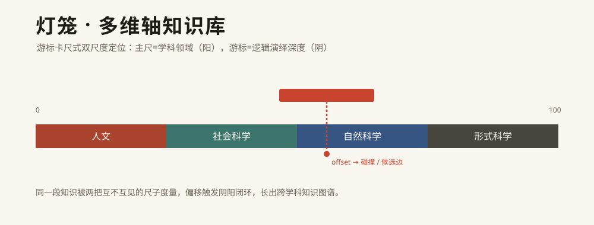
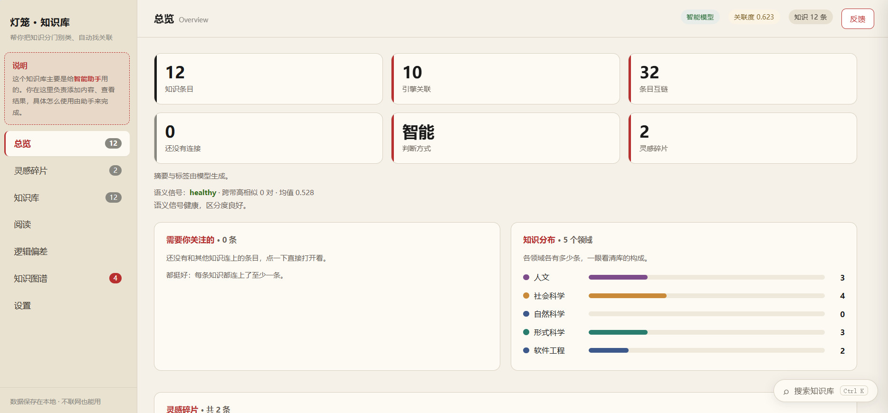
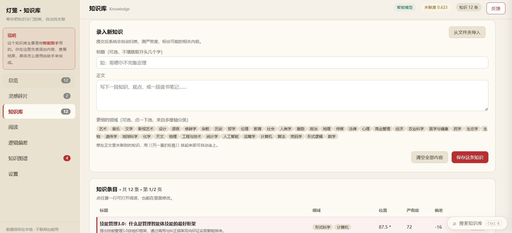
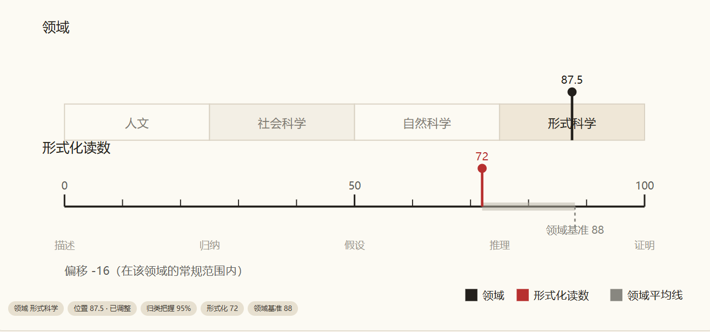
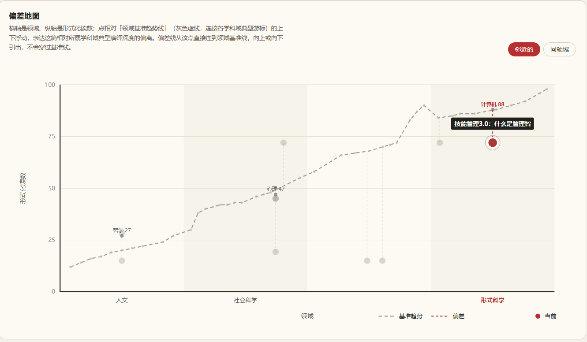
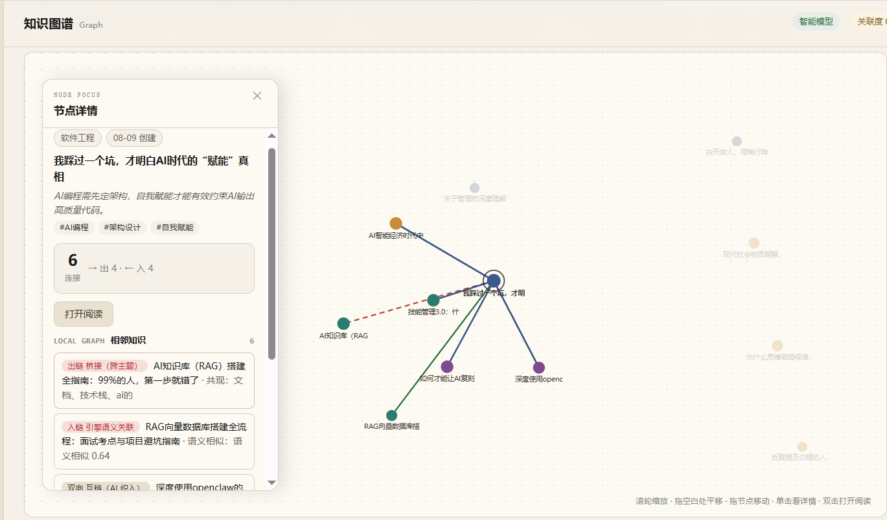
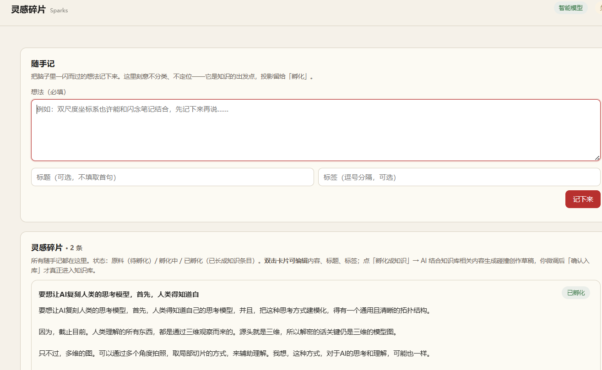

<p align="center">
  
</p>

# 灯笼 · 多维轴知识库

一个本地优先、可被 AI Agent 调用并持续维护的多维轴知识库，以及它的可视化工作台。

它用一把「游标卡尺」给每一条知识同时度量两个维度——**主尺 = 学科领域（阳·感知归类），游标 = 逻辑演绎深度（阴·深层推理）**，再让两尺的偏移触发阴阳闭环，自动长出跨学科的知识图谱。公开仓库只包含合成演示数据，**不包含作者的真实知识库**。

## 能做什么

- **双尺度定位**：每条知识都被两把互不互见的尺子度量，得到「领域带 + 演绎深度」的坐标，而不是单维度的文件夹归档。
- **阴阳闭环**：游标读数偏离所在领域带的典型值时触发闭环，自动产出跨学科候选知识边（逻辑同构 / 未形式化），让差异被摊开、而非被抹平。
- **知识图谱（双来源叙事）**：硬链 = AI 织入（`[[...]]`，确定性关联），软链 = 引擎发现（关键词共现 / 语义相似 / 跨域桥接）。两类来源、置信度与着色在 UX 上明确区分。
- **概念衍生层**：后端把知识提炼为概念节点并做双向桥接推荐，作为「推荐其他关联文档」的中间件，不污染图谱节点。
- **检索增强（RAG 原生）**：离线评分检索 + 最近邻 + 关系聚合（`kb_context`），直接聚合成可粘贴进 Agent 自身 prompt 的上下文文本。
- **反馈邮箱**：引擎自检发现的问题（分类漂移 / 跨域同构 / 未形式化）经节流后右下角逐条弹窗 + 侧边收件箱呈现，且不污染文章正文。
- **独立性守卫**：用实证皮尔逊相关系数守护两尺独立性，两尺坍缩时真拉闸、隔离偏移，而非带病运行。
- **本地优先、零外部服务**：核心引擎纯 Python 标准库 + SQLite，不填大模型凭据也能全功能运行（走本地启发式）；填了则读数升级为真实模型结果。高质量本地语义嵌入为可选依赖 `sentence-transformers`（见 `requirements.txt`），模型已随仓库附于 `.models/`。

## 界面预览

主图是界面结构**示意**（非截图）。工作台由五视图组成：

- **总览**：知识库健康度、领域分布、双尺独立性检验、灵感碎片统计。
- **知识库**：按双尺度坐标浏览全部知识，支持检索与过滤、双击阅读。
- **逻辑偏差**：双尺度坐标地图，红虚线为引擎发现的跨域候选边，是灯笼的标志性视图。
- **知识图谱**：硬链（AI 织入）与软链（引擎发现）双来源叙事，可默认只铺节点、点选展开连线。
- **灵感碎片**：无坐标的原料舱，随手记、关键词聚类、智能孵化成知识条目。

### 真实界面截图
<table>
  <tr>
    <td align="center" valign="top">
      <br>
      <b>① 总览</b><br>
      <sub>库的健康度、领域分布、双尺独立性检验与灵感碎片统计，一眼概览。</sub>
    </td>
  </tr>
  <tr>
    <td align="center" valign="top">
      <br>
      <b>② 知识库</b><br>
      <sub>按双尺度坐标浏览全部知识，支持检索、过滤与双击阅读。</sub>
    </td>
  </tr>
  <tr>
    <td align="center" valign="top">
      <br>
      <b>③ 逻辑偏差 · 坐标地图</b><br>
      <sub>双尺度坐标地图，红虚线为引擎发现的跨域候选边，灯笼标志性视图。</sub>
      <br><br>
      <br>
      <b>③ 偏差地图</b><br>
      <sub>横轴领域、纵轴形式化读数；点相对「领域基准趋势线」的浮动表达偏离。</sub>
    </td>
  </tr>
  <tr>
    <td align="center" valign="top">
      <br>
      <b>④ 知识图谱</b><br>
      <sub>硬链（AI 织入）与软链（引擎发现）双来源叙事，点选节点展开连线。</sub>
    </td>
  </tr>
  <tr>
    <td align="center" valign="top">
      <br>
      <b>⑤ 灵感碎片</b><br>
      <sub>无坐标的原料舱：随手记、关键词聚类、智能孵化成知识条目；卡片双击编辑、长内容单击展开。</sub>
    </td>
  </tr>
</table>

## 核心思想（一图速览）

> 同一段知识被两把互不互见的尺子度量：主尺判定它属于哪个学科领域带，游标判定它的逻辑演绎有多深。
> 当「游标读数 − 该领域带的典型游标值」超过阈值，便认为这段知识在形式上「离域典型远」，
> 触发阴阳闭环，并建议一条跨学科候选边——把不易注意到的结构差异摊开给人看，不下优劣结论。

坐标语义详见 [`AGENTS.md`](AGENTS.md) 的「坐标语义 / 独立性守卫」章节。

## 架构：分层与前后端分离

刻意把**引擎、后端服务、前端**拆成三层，互不越界：

```
┌──────────────────────────────────────────────────────────────┐
│  frontend/   前端（静态 SPA，纯展示窗）                          │
│   index.html · css/ · js/  —— 只通过 /api/* 取数  │
└───────────────────────────┬──────────────────────────────────┘
                              │  HTTP / REST（JSON）
┌───────────────────────────┴──────────────────────────────────┐
│  backend/    后端服务层（服务端 Python，仅标准库）               │
│   server.py   薄传输层：HTTP 连接 / JSON / 静态托管 / 定时扫描   │
│   routes.py   REST 路由表（method+path → handler，与传输解耦）   │
│   kb.py       Agent 工具门面（29 个 kb_* 工具，REST/MCP/CLI 同源）│
│   kb_cli.py   CLI 直连入口（无需服务在线，直读 lantern.db）      │
│   mcp_server.py  MCP stdio 入口（server 名 lantern-kb）         │
│   seed_demo.py   合成演示数据生成器                              │
└───────────────────────────┬──────────────────────────────────┘
                              │  import
┌───────────────────────────┴──────────────────────────────────┐
│  lantern_caliper/   引擎（核心业务逻辑，纯数据职能）             │
│   items / links / graph / concepts / measure / feedback /       │
│   schema / sparks / articles / audit / summarize / guard / core │
│  llm.py            LLM provider 封装（引擎依赖，留仓库根）        │
│  lantern.db        SQLite 单一真相源                             │
└──────────────────────────────────────────────────────────────┘
```

**三条铁律**：① 前端绝不碰业务逻辑，只消费 REST；② 引擎只管数据职能（定位/检索/关系），不依赖 web/服务；③ 后端服务层是引擎与三通道（REST/MCP/CLI）之间的薄壳，所有能力经 `kb.py` 同一份 `TOOLS`/`dispatch` 暴露，三通道行为完全一致。

## 目录结构

```text
lantern-caliper/
├── backend/            # 后端服务层（服务端 Python）
│   ├── server.py       # HTTP 服务：REST 传输层 + 静态前端托管（默认 127.0.0.1:8731）
│   ├── routes.py       # REST 路由表与 handler（与传输层解耦）
│   ├── kb.py           # Agent 工具门面（29 个 kb_* 工具，REST/MCP/CLI 同源）
│   ├── kb_cli.py       # 命令行直连入口（无需服务在线，直接读 lantern.db）
│   ├── mcp_server.py   # MCP stdio 服务入口（server 名 lantern-kb）
│   └── seed_demo.py    # 生成合成演示数据（绝不入库真实个人数据）
├── frontend/           # 前端（静态 SPA）：index.html / css / js
├── lantern_caliper/    # 引擎（双尺度定位 / 检索 / 图谱 / 概念层 / 守卫 / 反馈）
├── llm.py              # 大模型 provider 封装（断路 / 缓存 / 输入互补切分）
├── schema.json         # 「构成逻辑」配置：领域带 / 阈值 / 独立性 / 概念层
├── articles/           # 知识库的可读 Markdown 镜像（与 DB 双向同步）
├── docs/               # 文档与配图
├── skills/             # 配套 Agent Skills（lantern-kb / lantern-method）
├── README.md           # 本文件
├── AGENTS.md           # Agent 接口规范（工具清单 / 三通道 / 坐标语义）
├── LICENSE             # MIT
├── .env.example        # 大模型凭据模板（真实 .env 已被 .gitignore 排除）
└── .gitignore
```

## 怎么使用

推荐把这个仓库直接交给支持代码和终端操作的 AI Agent（Codex / Claude Code / WorkBuddy 等），让它负责克隆、安装、启动与数据适配。核心引擎纯标准库、**无需 pip install**；若启用本地高维语义嵌入，先 `pip install -r requirements.txt`（拉取 sentence-transformers + torch，模型已随仓库附于 `.models/`）。

```bash
# 1) 生成演示库（首次或重置；合成数据，无个人信息）
python backend/seed_demo.py            # 库不存在时自动生成 9 条演示知识
python backend/seed_demo.py --force    # 清空并重建一份干净的演示数据

# 2) 启动服务（后端 HTTP 服务 + 静态前端托管）
python backend/server.py               # 监听 http://127.0.0.1:8731/
```

打开浏览器访问 `http://127.0.0.1:8731/` 即可。若 `lantern.db` 不存在，服务首次启动也会自动建库并种入演示数据，因此只跑 `python backend/server.py` 也能直接体验。

> 要求 Python 3.10+。不配置大模型时，双尺定位走本地启发式，全功能可用。

**可选 · 本地高维语义嵌入**：模型已随仓库附于 `.models/bge-small-zh-v1.5/`（由 Git LFS 管理，克隆即随附）。要启用，先 `pip install -r requirements.txt`（sentence-transformers + torch）。未安装时系统自动回退到哈希兜底，仍可运行，仅语义区分度略低。

## REST API 契约

所有接口以 JSON 通信，基址 `http://127.0.0.1:8731`。知识库能力统一为
`POST /api/kb/<tool>`（请求体 JSON），所有 `kb_*` 工具名与 [`AGENTS.md`](AGENTS.md) 一一对应；
另有若干只读/辅助端点供前端轮询。路由表集中在 `backend/routes.py`，与传输层解耦。

### 系统 / 引擎状态（GET）
| 端点 | 说明 |
|------|------|
| `/api/schema` | 「构成逻辑」快照（领域带 / 阈值 / 模式 / 独立性 / 概念层） |
| `/api/state` | 工作台总览（条目 / 边 / 独立性 / 信号 / 健康度 / provider） |
| `/api/llm` | 大模型 provider 状态 |
| `/api/isolation` | 两尺输入互补切分演示（`?text=`） |
| `/api/edges` | 候选跨学科边列表 |
| `/api/logs` | 引擎日志 |
| `/api/independence` | 两尺独立性检验 |
| `/api/audit-log` | 审计日志与统计 |
| `/api/audit-log/purge` (POST) | 清理 N 天前的审计日志（`keep_days`） |

### 反馈收件箱
| 端点 | 方法 | 说明 |
|------|------|------|
| `/api/feedback` | GET | 未读数与反馈列表（`?status=`） |
| `/api/feedback/read` | POST | 标记已读（`id`） |
| `/api/feedback/applied` | POST | 标记已应用（`id`） |
| `/api/feedback/dismiss` | POST | 忽略（`id`） |
| `/api/feedback/delete` | POST | 删除（`id`） |
| `/api/feedback/clear` | POST | 清空全部 |
| `/api/feedback/not_duplicate` | POST | 标记非重复对（`a`,`b`） |
| `/api/feedback/apply` | POST | 生成修订稿（`id`，不落库，前端 diff 确认） |

### 灵感碎片（原料层）
| 端点 | 方法 | 说明 |
|------|------|------|
| `/api/sparks` | GET | 列出碎片（`?status=`） |
| `/api/sparks` | POST | 新增碎片（`content` 必填，`title`/`tags` 可选） |
| `/api/sparks/clusters` | GET | 关键词共现聚类 |
| `/api/hatch/stats` | GET | 孵化事件统计 |
| `/api/sparks/<id>/hatch` | POST | 智能孵化（六阶段管线） |
| `/api/sparks/<id>/draft` | POST | 生成碰撞创作草稿（不落库） |
| `/api/sparks/<id>/commit` | POST | 确认草稿入库 |
| `/api/sparks/<id>/update` | POST | 改内容 / 标题 / 标签 |
| `/api/sparks/<id>/delete` | POST | 删除碎片 |

### 软链（引擎发现）确认 / 刷新
| 端点 | 方法 | 说明 |
|------|------|------|
| `/api/soft-link/confirm` | POST | 确认一条软链为硬链（`src_id`,`dst_id`） |
| `/api/soft-link/dismiss` | POST | 驳回一条软链 |
| `/api/soft-links/refresh` | POST | 重新跑全库关联发现并接入图谱 |

### 知识库（kb，POST `/api/kb/<tool>`）
`query` · `retrieve` · `fragments` · `neighbors` · `linked_neighbors` · `search` · `position` ·
`similar` · `suggest_links` · `relate` · `context` · `traverse` · `axes` · `backlinks` ·
`article`(GET) · `add` · `update` · `reload` · `delete` · `link` · `unlink` ·
`import` · `import_axes` · `embed_rebuild` · `backup` · `create_draft` · `state` · `schema` ·
`config`(GET) · `config_set`(POST) · `config_test`(POST) · `calibrate` · `mode`(GET/POST) ·
`edges`(GET) · `consolidate`(POST) · `concept_neighbors`(GET)

### 图谱 / 概念
| 端点 | 方法 | 说明 |
|------|------|------|
| `/api/graph` | GET | 知识图谱（节点 + 边，硬链/`[[...]]` + 软链） |
| `/api/concepts` | GET | 派生概念节点列表 |

## 接入自己的知识库

真实知识库数据**刻意不进公开仓库**：`lantern.db` 与 `articles/*.md` 已被 `.gitignore` 排除。你的本地数据留在自己机器上，克隆他人仓库不会带走你的知识。

- **换机器 / 协作**：把本地的 `lantern.db` 与 `articles/` 一起带走即可；它们只是 SQLite 文件与 Markdown 镜像，可直接用任意工具打开。
- **大模型（可选）**：复制 `.env.example` 为 `.env`，填写 `API_KEY` / `API_BASE` / `MODEL` 后重启服务。不填则保持本地启发式。

知识在「数据库（唯一真相源）」与「本地 `articles/<id>.md` 镜像」之间双向同步：界面保存会回写 `.md`，外部改了 `.md` 可经 API `kb_reload` 灌回数据库并重测坐标（阅读页原「从文件重新载入」按钮已替换为「删除」）。因此即便 `.md` 被误删，知识不丢。

## 配套 Agent Skills

让 Agent 把本知识库当成自带可调用的工具，在任意对话里联合使用：

- **`lantern-kb`**：知识库的薄壳 Skill，封装 `backend/kb.py` 的 29 个工具，经 `backend/kb_cli.py` 直接调用，无需服务在线。详见 [`AGENTS.md`](AGENTS.md)。
- **`lantern-method`**：多维轴认知方法 Skill，把对某个概念的理解通过多轴投影、冗余检查、反馈轴拆解成结构化知识条目，并编排写回本知识库。

把这两个 Skill 的地址交给你的 Agent 即可安装使用；安装方式、平台支持与执行边界以 Skill 仓库为准。

### 三通道等价调用

任何 Agent 都可通过**三条等价通道**调用同一套能力（共享 `backend/kb.py` 的同一份 `TOOLS` 与 `dispatch`）：

| 通道 | 适用对象 | 接入方式 |
|------|----------|----------|
| **REST** | HTTP 型 Agent / 脚本 / 浏览器 | `http://127.0.0.1:8731/api/kb/*`（先 `python backend/server.py`） |
| **MCP** | 支持 Model Context Protocol 的 Agent（Claude Desktop / Cursor / 框架） | `backend/mcp_server.py`，server 名 `lantern-kb` |
| **Skill + CLI** | WorkBuddy 等自带工具链的 Agent | 安装 `lantern-kb` Skill，经 `backend/kb_cli.py` 直连 |

## 示例与隐私

`backend/seed_demo.py` 生成的演示知识（诗词、数学、进化论、经济、法律、物理、哲学、神经科学、量子等样例）全部是从零编写的**合成数据**，不来自任何真实个人。

公开前已通过 `.gitignore` 把所有个人数据、凭据与运行时产物排除：

- 个人知识库 `lantern.db` / `articles/*.md` 不入库；
- 大模型密钥 `.env` / `llm_config.json` 不入库；
- 缓存 `llm_cache.db` 与日志 `server.log` 不入库。

## 版本迭代记录

按时间倒序记录本项目的关键迭代里程碑（基于仓库提交历史，最新在前）：

| 日期 | 里程碑 | 说明 |
|------|--------|------|
| 2026-08-23 | **检索结果按主题分组（非线性索引）** | 搜索抽屉新增「按主题分组」开关，结果按学科域带聚合成簇（组间按组内最高相关度排序）；后端 `multidim_search` 新增 `grouped` 返回形态，领域涌现 `list_domains` 改为 LEFT JOIN 防御性修复 |
| 2026-08-23 | **阅读页预览打磨** | 长文大纲锚点 + 滚动高亮、预览限宽左对齐、数字序号短句标题加粗（长句/段落不再误判）、图片与代码块增强 |
| 2026-08-23 | **反馈邮箱对话式修正闭环** | 系统自检问题关联真实条目并支持人在同一条反馈下直接修正（领域/摘要/意见），落回条目并标记已应用；领域守门与重复检测两类反馈可推送至对应条目 |
| 2026-08-23 | **入库摘要收口** | 三处落库点统一过 `sanitize_summary`（≤80 字纯陈述），本地摘要提取重写（跳过标题行、优先非连词陈述句），修复退化 |
| 2026-08-12 | **移除 theory.html** | 将不属于本项目的 `theory.html` 从仓库移除 |
| 2026-08-12 | **前端交互修正** | 灵感碎片单卡收拢交互、侧边栏说明文案、图谱徽标计数修复（按 `links` 表而非候选边表） |
| 2026-08-12 | **本地嵌入模型入仓** | `bge-small-zh-v1.5` 经 Git LFS 随仓库分发 + `requirements.txt` 可选依赖声明，克隆即带本地高维语义检索 |
| 2026-08-12 | **目录重构 + 孵化反哺** | `backend/frontend` 目录重构；孵化闭环改为解析反哺原始碎片 |
| 2026-08-11 | **图谱与交互打磨** | 图谱实线修复、冗余清理、交互打磨 |
| 2026-08-10 | **智能孵化升级** | 孵化从「文件搬运」升级为六阶段系统事件（冗余闸门 / 投影富化 / 全库关联发现 / 反馈自检 / 簇血缘 / 事件日志）；并改为两阶段（先出碰撞创作草稿、确认后再入库） |
| 2026-08-10 | **灵感碎片原料层** | 新增无坐标原料舱：随手记捕获、关键词共现聚类、智能孵化全链路 |
| 2026-08-10 | **开源首发** | 灯笼 · 多维轴知识库模块化架构（引擎 / 后端 / 前端三层分离）+ 文档 + 配套 Skills（`lantern-kb` / `lantern-method`）打包发布 |

## 许可证

MIT。见 [LICENSE](LICENSE)。
