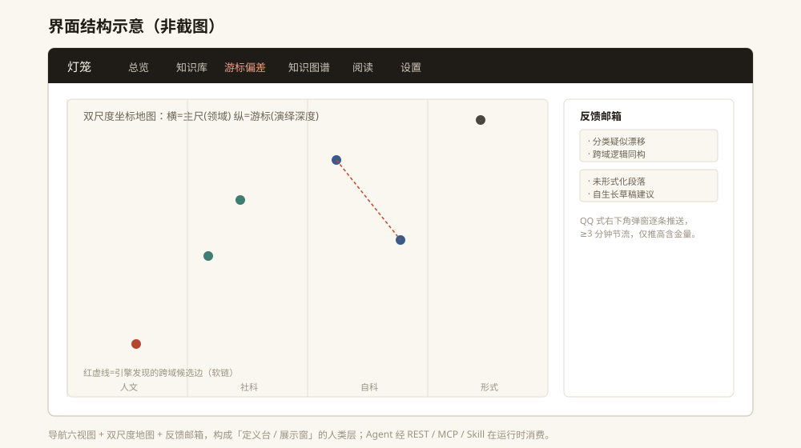

<p align="center">
  
</p>

# 灯笼 · 多维轴知识库

一个本地优先、可被 AI Agent 调用并持续维护的多维轴知识库，以及它的可视化工作台。

它用一把「游标卡尺」给每一条知识同时度量两个维度——**主尺 = 学科领域（阳·感知归类），游标 = 逻辑演绎深度（阴·深层推理）**，再让两尺的偏移触发阴阳闭环，自动长出跨学科的知识图谱。公开仓库只包含合成演示数据，**不包含作者的真实知识库**。

## 能做什么

- **双尺度定位**：每条知识都被两把互不互见的尺子度量，得到「领域带 + 演绎深度」的坐标，而不是单维度的文件夹归档。
- **阴阳闭环**：游标读数偏离所在领域带的典型值时触发闭环，自动产出跨学科候选知识边（逻辑同构 / 未形式化），让差异被摊开、而非被抹平。
- **知识图谱（双来源叙事）**：硬链 = 作者意图（`[[...]]`），软链 = 引擎发现（关键词共现 / 语义相似 / 跨域桥接）。两类来源、置信度与着色在 UX 上明确区分。
- **概念衍生层**：后端把知识提炼为概念节点并做双向桥接推荐，作为「推荐其他关联文档」的中间件，不污染图谱节点。
- **检索增强（RAG 原生）**：离线评分检索 + 最近邻 + 关系聚合（`kb_context`），直接聚合成可粘贴进 Agent 自身 prompt 的上下文文本。
- **反馈邮箱**：引擎自检发现的问题（分类漂移 / 跨域同构 / 未形式化）经节流后右下角逐条弹窗 + 侧边收件箱呈现，且不污染文章正文。
- **独立性守卫**：用实证皮尔逊相关系数守护两尺独立性，两尺坍缩时真拉闸、隔离偏移，而非带病运行。
- **本地优先、零外部服务**：纯 Python 标准库 + SQLite；不填大模型凭据也能全功能运行（走本地启发式），填了则读数升级为真实模型结果。

## 界面预览

<p align="center">
  
</p>

主图是界面结构**示意**（非截图）。工作台由六视图组成：

- **总览**：知识库健康度、领域分布、独立性检验、双尺 provider 状态。
- **知识库**：按双尺度坐标浏览全部知识，支持检索与过滤。
- **游标偏差**：双尺度坐标地图，红虚线为引擎发现的跨域候选边，是灯笼的标志性视图。
- **知识图谱**：硬链（作者意图）与软链（引擎发现）双来源叙事，可默认只铺节点、点选展开连线。
- **阅读**：单条知识全文与本地镜像文件，支持在知识库内改写或回灌外部编辑。
- **设置**：配置双尺 provider、碰撞阈值、领域带划分等「构成逻辑」。

## 核心思想（一图速览）

> 同一段知识被两把互不互见的尺子度量：主尺判定它属于哪个学科领域带，游标判定它的逻辑演绎有多深。
> 当「游标读数 − 该领域带的典型游标值」超过阈值，便认为这段知识在形式上「离域典型远」，
> 触发阴阳闭环，并建议一条跨学科候选边——把不易注意到的结构差异摊开给人看，不下优劣结论。

坐标语义详见 [`AGENTS.md`](AGENTS.md) 的「坐标语义 / 独立性守卫」章节。

## 目录结构

```text
lantern-caliper/
├── lantern_caliper/   # 后端引擎包（双尺度定位 / 检索 / 图谱 / 概念层 / 守卫 / 反馈）
├── web/               # 前端静态资源（index.html / theory.html / css / js）
├── docs/              # 文档与配图
├── schema.json        # 「构成逻辑」配置：领域带 / 阈值 / 独立性 / 概念层
├── server.py          # HTTP 服务（REST + 静态前端），默认 127.0.0.1:8731
├── kb.py              # Agent 工具层（29 个 kb_* 工具，REST / MCP / Skill 同源）
├── mcp_server.py      # MCP stdio 服务入口（server 名 lantern-kb）
├── kb_cli.py          # 命令行直连入口（无需服务在线，直接读 lantern.db）
├── llm.py             # 大模型 provider 封装（断路 / 缓存 / 输入互补切分）
├── seed_demo.py       # 生成合成演示数据（绝不入库真实个人数据）
├── README.md          # 本文件
├── AGENTS.md          # Agent 接口规范（工具清单 / 三通道 / 坐标语义）
├── LICENSE            # MIT
├── .env.example       # 大模型凭据模板（真实 .env 已被 .gitignore 排除）
└── .gitignore
```

## 怎么使用

推荐把这个仓库直接交给支持代码和终端操作的 AI Agent（Codex / Claude Code / WorkBuddy 等），让它负责克隆、安装、启动与数据适配。项目只依赖 Python 标准库，**无需 pip install**。

```bash
# 1) 生成演示库（首次或重置；合成数据，无个人信息）
python seed_demo.py            # 库不存在时自动生成 9 条演示知识
python seed_demo.py --force    # 清空并重建一份干净的演示数据

# 2) 启动服务
python server.py               # 监听 http://127.0.0.1:8731/
```

打开浏览器访问 `http://127.0.0.1:8731/` 即可。若 `lantern.db` 不存在，服务首次启动也会自动建库并种入演示数据，因此只跑 `python server.py` 也能直接体验。

> 要求 Python 3.10+。不配置大模型时，双尺定位走本地启发式，全功能可用。

## 接入自己的知识库

真实知识库数据**刻意不进公开仓库**：`lantern.db` 与 `articles/*.md` 已被 `.gitignore` 排除。你的本地数据留在自己机器上，克隆他人仓库不会带走你的知识。

- **换机器 / 协作**：把本地的 `lantern.db` 与 `articles/` 一起带走即可；它们只是 SQLite 文件与 Markdown 镜像，可直接用任意工具打开。
- **大模型（可选）**：复制 `.env.example` 为 `.env`，填写 `API_KEY` / `API_BASE` / `MODEL` 后重启服务。不填则保持本地启发式。

知识在「数据库（唯一真相源）」与「本地 `articles/<id>.md` 镜像」之间双向同步：界面保存会回写 `.md`，外部改了 `.md` 可用「从文件重新载入」一键灌回数据库并重测坐标。因此即便 `.md` 被误删，知识不丢。

## 配套 Agent Skills

让 Agent 把本知识库当成自带可调用的工具，在任意对话里联合使用：

- **`lantern-kb`**：知识库的薄壳 Skill，封装 `kb.py` 的 29 个工具，经 `kb_cli.py` 直接调用，无需服务在线。详见 [`AGENTS.md`](AGENTS.md)。
- **`lantern-method`**：多维轴认知方法 Skill，把对某个概念的理解通过多轴投影、冗余检查、反馈轴拆解成结构化知识条目，并编排写回本知识库。

把这两个 Skill 的地址交给你的 Agent 即可安装使用；安装方式、平台支持与执行边界以 Skill 仓库为准。

### 三通道等价调用

任何 Agent 都可通过**三条等价通道**调用同一套能力（共享 `kb.py` 的同一份 `TOOLS` 与 `dispatch`）：

| 通道 | 适用对象 | 接入方式 |
|------|----------|----------|
| **REST** | HTTP 型 Agent / 脚本 / 浏览器 | `http://127.0.0.1:8731/api/kb/*`（先启动 `server.py`） |
| **MCP** | 支持 Model Context Protocol 的 Agent（Claude Desktop / Cursor / 框架） | `mcp_server.py`，server 名 `lantern-kb` |
| **Skill + CLI** | WorkBuddy 等自带工具链的 Agent | 安装 `lantern-kb` Skill，经 `kb_cli.py` 直连 |

## 示例与隐私

`seed_demo.py` 生成的演示知识（诗词、数学、进化论、经济、法律、物理、哲学、神经科学、量子等样例）全部是从零编写的**合成数据**，不来自任何真实个人。

公开前已通过 `.gitignore` 把所有个人数据、凭据与运行时产物排除：

- 个人知识库 `lantern.db` / `articles/*.md` 不入库；
- 大模型密钥 `.env` / `llm_config.json` 不入库；
- 缓存 `llm_cache.db` 与日志 `server.log` 不入库。

## 许可证

MIT。见 [LICENSE](LICENSE)。
